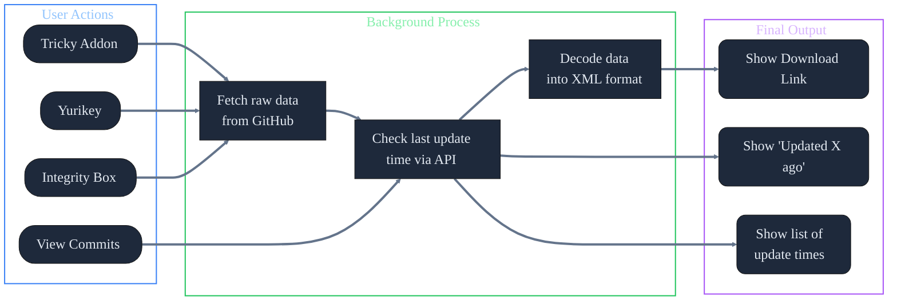

## 🔐 FetchBox — [🌐 Website](https://zyg0t.github.io/FetchBox)
**Flowchart of the functionality because flowcharts make me look smart**

```mermaid
%%{init: {
  "theme": "base",
  "themeVariables": {
    "primaryColor": "#1e293b",
    "primaryTextColor": "#e2e8f0",
    "lineColor": "#64748b",
    "fontSize": "24px",
    "fontFamily": "Inter, Segoe UI, sans-serif"
    
  }
}}%%

graph LR

    subgraph Buttons["User Actions"]
        B1["Tricky Addon"]
        B2["Yurikey"]
        B3["Integrity Box"]
        B4["View Commits"]
    end

    subgraph Logic["Background Process"]
        direction TB
        L1["Fetch raw data<br/>from GitHub"]
        L2["Check last update<br/>time via API"]
        L3["Decode data<br/>into XML format"]
    end

    subgraph Result["Final Output"]
        R1["Show Download Link"]
        R2["Show 'Updated X ago'"]
        R3["Show list of<br/>update times"]
    end

    B1 --> L1
    B2 --> L1
    B3 --> L1
    
    L1 --> L2
    L2 --> L3
    
    L3 --> R1
    L2 --> R2

    B4 --> L2
    L2 --> R3

    style Buttons fill:transparent,stroke:#3b82f6,stroke-width:2px,color:#93c5fd
    style Logic fill:transparent,stroke:#22c55e,stroke-width:2px,color:#86efac
    style Result fill:transparent,stroke:#a855f7,stroke-width:2px,color:#d8b4fe

    style B1 rx:28px, ry:28px
    style B2 rx:28px, ry:28px
    style B3 rx:28px, ry:28px
    style B4 rx:28px, ry:28px

    style R1 rx:15px, ry:15px
    style R2 rx:15px, ry:15px
    style R3 rx:15px, ry:15px

    linkStyle 0 stroke-width:4px
    linkStyle 1 stroke-width:4px
    linkStyle 2 stroke-width:4px
    linkStyle 3 stroke-width:4px
    linkStyle 4 stroke-width:4px
    linkStyle 5 stroke-width:4px
    linkStyle 6 stroke-width:4px
    linkStyle 7 stroke-width:4px
    linkStyle 8 stroke-width:4px
```
